# DemograficAtlas

Mapping the World, Understanding People

## Video Explainer

Below you can see the explanation video about Docker. [Click Here](https://www.youtube.com/watch?v=SLt9raYGnig)

## Get Started

To start using the DemograficAtlas application we must clone this repository to obtain the necessary files, in this case the docker-compose, which will allow us to run the application.

```bash
git clone https://github.com/GabrielSB19/TechFellowQueryBuilder

cd TechFellowQueryBuilder
```

Once we have the repository downloaded, the next thing we must do is to run the docker compose, for that we execute the following command

```bash
docker-compose up
```

Now, we must wait for our application to get up and run

The ports that will be used by each one of the services of our application will be the following ones:

- Frontend: 9000
- Backend: 8000
- PostgreSQL: 5432

## Use the App

To start using the application we must go to our trusted browser and go to the following URL [Click here](http://localhost:9000), This URL will take us to the localhost with port 9000. (Remember to run docker compose to get the services up and running)

## App functionalities

DemograrficAtlas is an application that will allow you to see the population around the world, you will be able to see this application through graphs that will help you to understand in a better way the data that you obtained through the chosen filters.

### Welcome Screen

Once you enter the application, you will find a welcome image to the app, in this screen you will be asked for your username, which you must enter to continue to the dashboard tab and start making your queries about the population of the world.

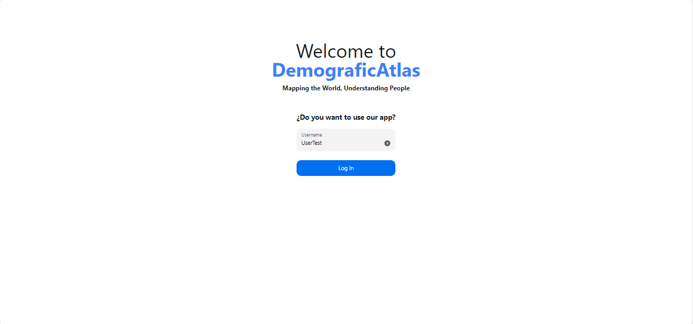

When the number of characters in your username is greater than 3, the login option will be enabled.

### Visual Summary of Queried Data

In this part you will find the dashboard of the application, the most important and interesting part. In this screen you will find all the filters available for you to make your query. The filters are the following

- Country: Select a country (If you chose a country, you cannot chose a region)
- Region: Select a region of the wolrd (If you chose a region, you cannot chose a country)
- Age min: Select the minimum age of the people
- Age max: Select the maximum age of the people
- Year min: Select the minimum year to filter
- Year max: Select the maximun year to filder
- Gender: Selec the gender, Male, Female or All

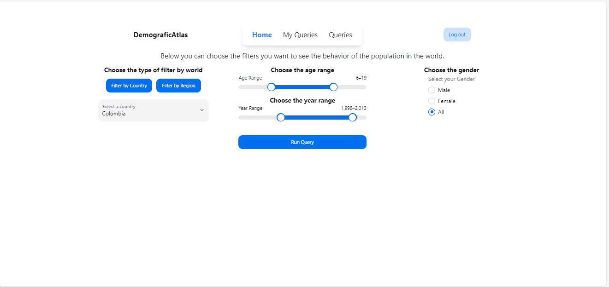

when you have all the filters selected, the option to run the query will be enabled.

Run the query, you can now visualize your data


Now you can visualize the behavior of the population in Colombia in the selected years through a line graph, which if you stand on a point will show you the specific data of that value.

### Save Query With Name, Username, and Comment

What is better than being able to visualize our data? If so, being able to save it. For this reason after running the query the next step is to save this query, we can do it by pressing the following button

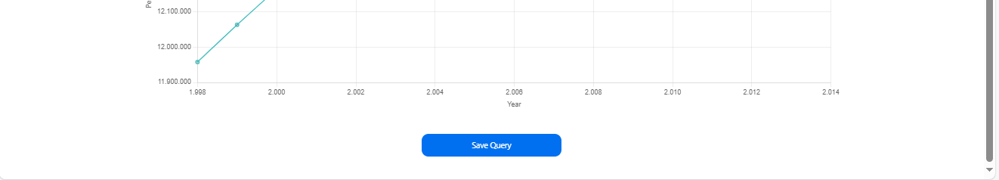

Once you press the save query button a modal will be displayed which will ask you for additional information to save this query. You are free to type whatever you want

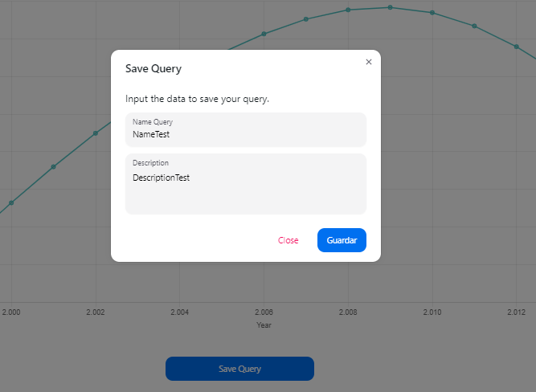

Great, you've already saved your query

### Show All Saved Queries

What is the point of storing information if we cannot access it? DemograficAtlas has the option to view all saved queries, we have two options, to view only the queries that are created by us and all queries that are created by other users.

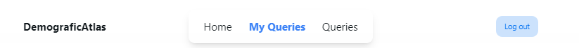

Here we can see both options, now let's go to view our own queries

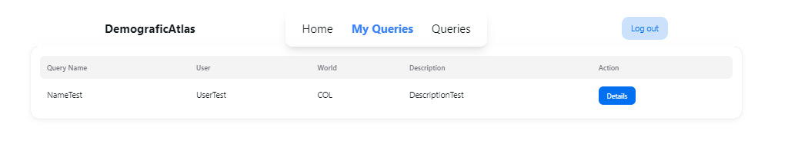

Let's see all the queries created by others

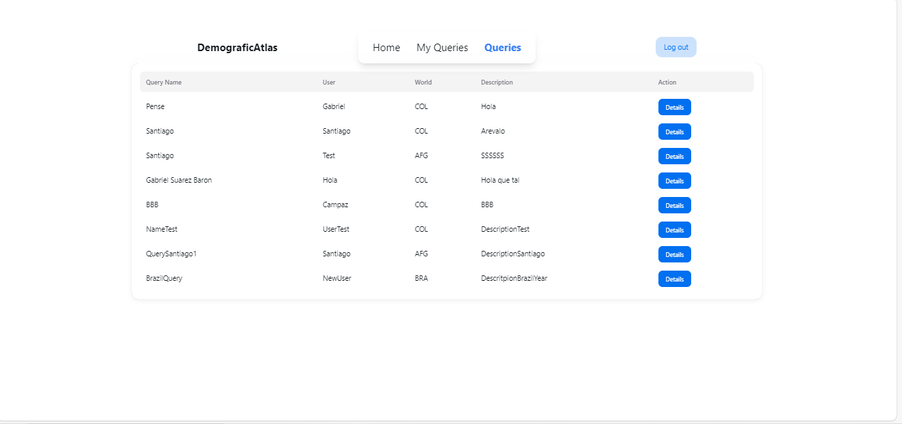

### Select Saved Query

You can see that in the list of queries there is a button called details, if we press that button we can see the query we selected, we can see the graph that was generated and also the query data.

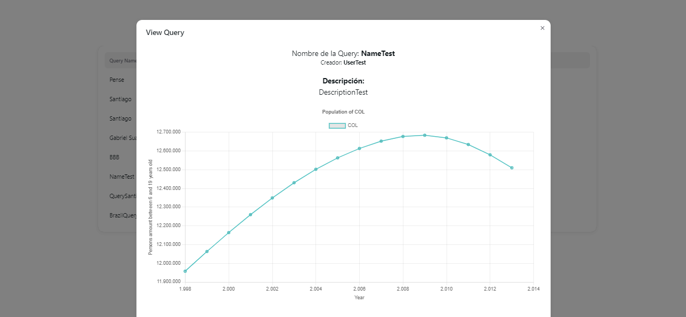

We can now see the data we saved, however, one functionality is missing. We can also go back to the construction of this query, in order to edit it as we wish. To do this we must select the following button at the end of the modal called Edit Query


Once we click on the edit button, the application will take us to the main dashboard where all filters will be set to the values that were set when the query was saved.

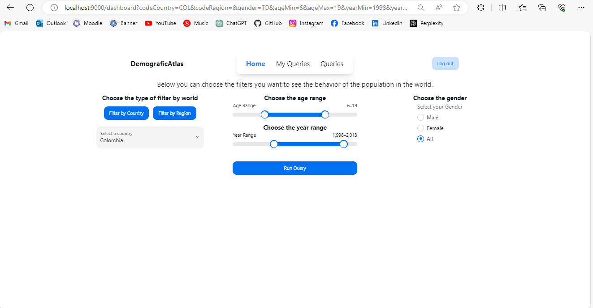

### Comment on Query

If you have questions or want to comment on a query saved by another user, DemograficAtlas allows you to do so. To do this we must go to the same button that allows us to visualize the query, that is to say to the button called details. When you press this button you will be able to see the comments section.

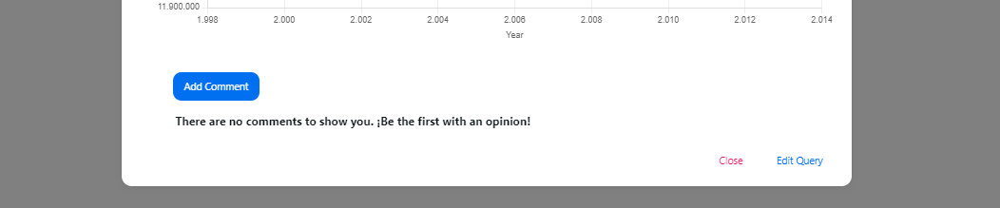

If there are no comments, the user will be notified. No comments? Let's create one. To create a comment we must click on the add comment button and a container with this functionality will be displayed.

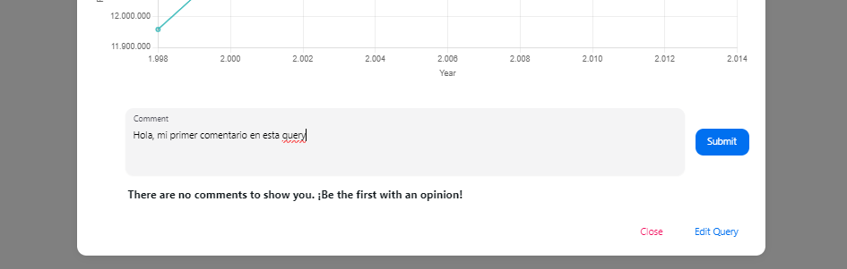

To save the comment, click on the submit button. Now we can see our comment displayed in the list.

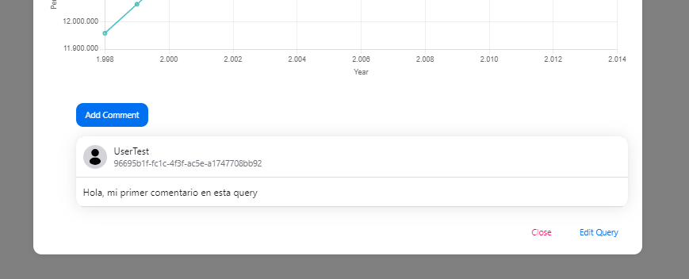

We can add more than one comment

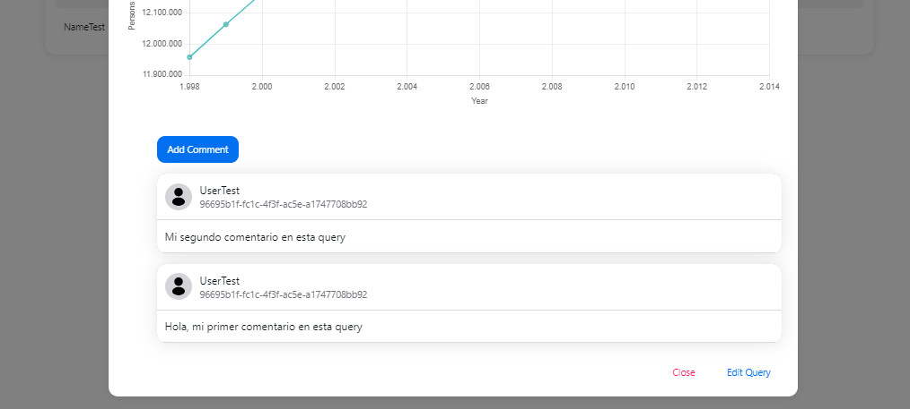

We can also interact with other people, because the comments of all users who comment on each query are displayed. Depending on the age of the comment it will be shown first.

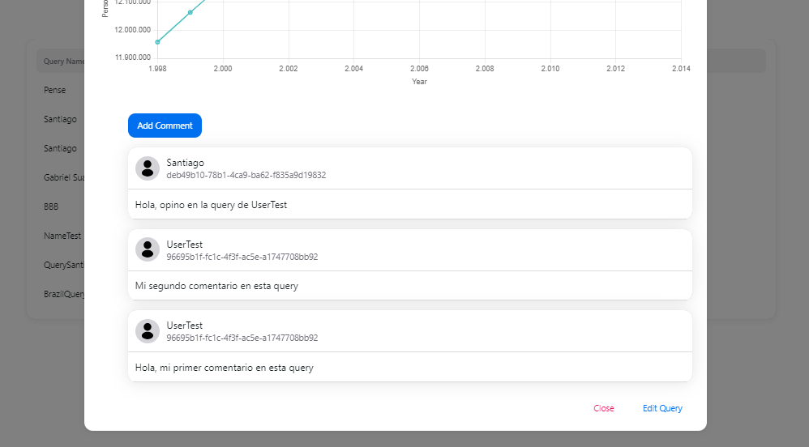

### Persistence

As shown throughout the application flow, the data is persistent because it is stored in a database which is consumed by the backend of our application.

### Multiplayer Functionality

Several users can use this application at the same time

These are all the features of Demografic Atlas, stay tuned for possible updates of the app.
